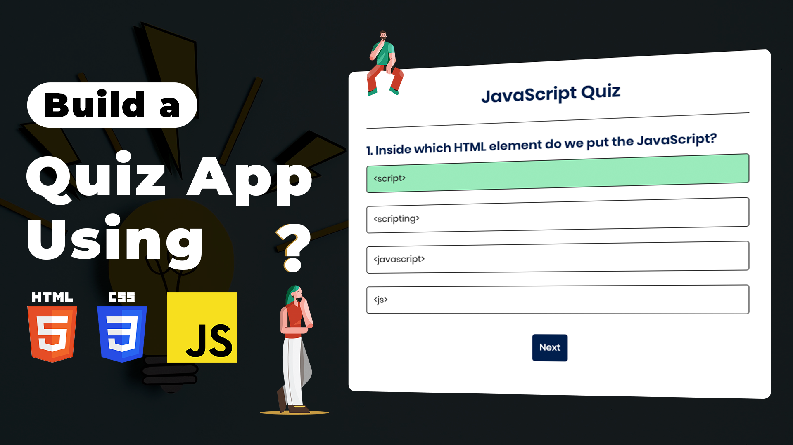

# Quiz App Using JavaScript | Build Quiz App using HTML CSS & Javascript

The Quiz App Using JavaScript project offers an engaging way to learn JavaScript while building a fully functional quiz application from scratch. By utilizing HTML, CSS, and JavaScript, learners can develop a dynamic and interactive quiz interface that presents questions, allows users to select answers, and provides instant feedback on their responses.

Live Preview: https://constgenius.github.io/QuizApp/

Youtube Tutorial: https://youtu.be/O3KQ6VM4rAw

This project covers essential concepts such as DOM manipulation, event handling, and conditional logic, providing hands-on experience in JavaScript programming. Through this tutorial, developers can enhance their understanding of JavaScript fundamentals while creating a fun and educational quiz application.

Overall, the Quiz App project serves as an excellent opportunity for JavaScript enthusiasts to apply their skills in a practical and enjoyable context, solidifying their knowledge and proficiency in web development.

